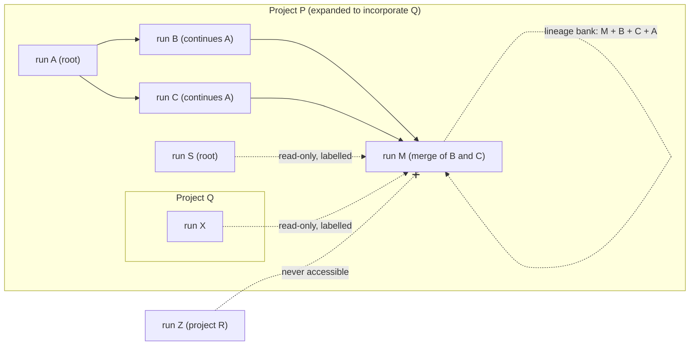

# The Aive Memory Clerks — Training and Deployment Contract

This document is normative for The Aive's local memory-clerk model family.

Memory clerks organize what was thought, said, done, requested, observed, or produced. They do not decide what should be thought.

## Architecture

The Aive uses two distinct local-inference families:

1. **Eight structured generative clerks** based presumptively on `Qwen/Qwen2.5-0.5B-Instruct`, with specialist LoRA/PEFT adapters where practical.
2. **One semantic association clerk** based on a compact MiniLM-style embedding model and cosine similarity.

`AssociationLinker` is not a Qwen generation role. Do not train it as one.

The eight generative roles are:

- `Sectioner`
- `SalienceFilter`
- `NounTagger`
- `VerbTagger`
- `PhraseSynthesizer`
- `SummarySynthesizer`
- `CategoryClassifier`
- `CondensationRewriter`

The embedding role is:

- `AssociationLinker`

The corresponding runtime contracts are intentionally separate:

- `MemoryGenerativeInferenceRuntime` — autoregressive structured generation for the eight Qwen-style clerks.
- `MemoryEmbeddingInferenceRuntime` — vector embeddings for `AssociationLinker`.

Do not reintroduce a unified inference contract that lets the association worker masquerade as a generator.

## Governing boundary

Memory clerks may:

- segment
- retain or omit obvious noise
- normalize
- extract semantic entity indexes
- extract semantic action indexes
- synthesize short retrieval phrases
- summarize bounded source material
- categorize
- associate related memories
- condense redundant representations

They must not independently decide:

- truth or falsity
- correctness
- contradiction
- which conflicting statement wins
- morality
- blame
- strategy
- which implementation is better
- which belief should prevail
- whether one substantive memory invalidates another

If source material explicitly contains such a judgment, a clerk may preserve that judgment as source material. It may not originate the judgment.

There is no memory-layer `ConflictResolver` role.

`AssociationLinker` may emit only semantic relatedness such as `SimilarTo` and `AssociatedWith`. It must never infer or emit `ConflictsWith`.

No model-backed clerk may write `Supersedes`, `ResolvesConflict` or `ConflictsWith`: they are not in
the relation list any model prompt offers (`MODEL_WRITABLE_RELATIONS`), and both model decoders
(`StructuredMemoryMicroAgent`, `TextGenerationMemoryManagerAgent`) reject an answer that uses them, or
the engine-owned kinds below. `ConflictsWith` and `ResolvesConflict` remain only so older stored
graphs still load; nothing writes them.

The engine enforces the boundary; it does not trust a clerk to keep it. Whatever runs a stage
(programmatic, local model, hosted provider), `MemoryConsolidator` validates the answer in code:

- Clerks only add. No answer edits or deletes a stored record.
- Every derived node and section must point at sources inside its packet, and keep its source episode.
- A condensation cluster is never offered to any clerk if two of its members assert different values
  (a number, a quoted string, or negation in some but not all; `memoryClaimSignature`) or **contrast**
  (same frame, different filler; below). Members are dropped from a cluster greedily until none
  contrast or carry a divergence marker to each other, so agreeing members can still fold.
- A condensation must restate its sources' values unchanged (same claim signature), create exactly one
  memory, and link every source through `CondensedFrom`. A clerk that also emits `Supersedes` (or any
  relation other than `CondensedFrom`/`AssociatedWith`) is rejected, and the cluster is declined once
  it keeps failing.
- **Consolidation rewrites the current memory; storage stays add-only.** After accepting a
  condensation, the engine adds `Supersedes` from the generalized memory to every source: the members
  are the same memory (similar, never contrasting), so the generalized memory is the new current
  version and the sources become history. History is never deleted: it stays in the store with its
  provenance, reachable through `CondensedFrom` and `MemorySnapshot.historyOf`, and fades from default
  recall. A memory already folded into a condensation is not offered for condensation again. Every
  rewrite is fitted to its size budget (below).
- Forgetting an episode removes what was derived only from it; memories with other sources stay, and
  a register variant no remaining memory attests is removed with it.

Condensation exists to fold repeated and similar memories, as people do. The defect it must avoid is
treating a **frame** match as similarity. Every statement has a frame (what it is about: its subject
and the question or predicate it answers) and a filler (what it says in that slot). "I chose Postgres
for the database" and "I chose MySQL for the database" share a frame and differ in filler: they are
not similar, they are a contrast, and memory keeps both until an agent has deliberated over them. The
implementation is a surface diff, not a lexicon.

### Contrast, variant register, divergence marker, deliberation

All of this is deterministic code in the engine (`MemoryContrast.kt`, `MemoryVariantRegister.kt`),
the same for every clerk engine, and none of it judges which memory is right.

- **Contrast** (`MemoryContrast.between`): tokenize both texts, fold entity aliases
  (`MemoryAliases`, a small explicit alias table: "Postgres", "PostgreSQL", "psql" are one name), and
  align them by longest common subsequence. The shared tokens are the frame; each gap is a slot. A pair
  contrasts when the shared part holds at least half the content words of the shorter text and some
  slot either holds different content words on both sides, at least one of which looks like a filler
  (a number or identifier, a capitalized name, a quoted string, or a value word such as
  `enabled`/`disabled`, `tabs`/`spaces`), or carries negation on one side only. A repeat, an aliased
  spelling or an added word ("…today") is not a contrast. This is a heuristic: it can miss a contrast
  phrased with different structure, and it can flag two lowercase names it reads as values.
- **Divergence marker** (`Diverges`): when an episode reaches the condensation stage, before any
  condensation, the engine compares each of its Context, Phrase and Summary memories with up to 48
  same-kind memories sharing a content word in the workflow's lineage bank (its own records and its
  ancestors'; never another workflow's read-only bank) and links every contrasting pair, writing the
  marker into the workflow's own bank. When a merge marries lineages, the engine compares the
  memories of the married sides and marks their contrasts in the merging workflow's bank
  (`MemoryVariantRegister.mergeMutationFor`). The marker is structural and advisory: it says the two
  differ, nothing more. A generalized memory inherits its sources' markers.
- **Variant register**: for each frame, a `Frame` node and one `Variant` node per filler
  (`VariantOf`), and an `Attests` edge from every memory that states that filler. Each attestation
  records age (the memory's record time, its episode times and, when the text states an ISO date, that
  event date), context (sessions, project, workflow run, task run, role), subject (the frame's words
  before the first slot) and source episodes; a variant's occurrence count is its distinct source
  episodes. It is add-only and keyed by content, so writing it twice is a no-op. Read it with
  `MemorySnapshot.variantRegister()`. Nothing in it is ranked as correct.
- **Recall unit**: every recall result with an unresolved divergence carries its divergent partners
  (`MemoryRecallHit.conflicts`, from `Diverges` and legacy `ConflictsWith`) and any deliberations about
  them, including partners that are superseded, out of the query's scope or did not match. Ranking, the result budget, the
  attention dial and prompt rendering all handle a hit and its partners as one item; rendering adds
  whole units only and never cuts one in two. Surfacing is on by default (`includeConflicts = true`).
- **Deliberation record**: an agent's conscious conclusion about a divergence,
  `MemoryTool.deliberate(MemoryDeliberationRequest)`. It is stored as its own episode (in the current
  workflow's bank) and a `Deliberation` node citing the memories (and naming the evidence) it
  considered (`Deliberates`). It may name the cited memory it judged correct (`chosen`), or conclude
  "unresolved" (`chosen = null`). It is never sectioned or condensed itself.

### Resolved contrasts: deliberation, then absorption

Clerks never pick a side, and contrasting memories are never condensed on similarity. A contrast is
consolidated only after conscious judgment:

1. An agent investigates the divergence (the memories and any other evidence) and records a
   deliberation that names the memory it judged correct.
2. The next consolidation pass absorbs it (`MemoryDeliberationAbsorber`, deterministic): it writes a
   new current version with the chosen memory's text (fitted to its size budget), tagged with the
   consolidating workflow, `CondensedFrom` the chosen memory and the deliberation. Every cited memory
   and its current versions become history (`Supersedes`, basis `deliberation`); the not-chosen side is
   linked from the version (`notChosen`) and explained by the deliberation.
3. A deliberation with no choice absorbs nothing: no deliberation, no consolidation of a contrast.
4. A later deliberation over the same memories reopens it: its absorption writes a newer current
   version that supersedes the earlier one. Everything stays reachable.

Recall then returns the resolved memory as a single memory, not a divergence unit, so a model does not
re-adjudicate it on every recall. Its contradiction history (`MemoryRecallHit.resolution`: the
deliberation and the not-chosen side) is attached, and how much of it is rendered decays with access.
Each recall that delivers it appends one access event (`Recalled`, from the resolving deliberation to
the memory, in the reading workflow's bank; add-only, counted rather than kept as a mutable counter):

| Recalls so far | Rendered under the memory |
|---|---|
| fewer than `RESOLVED_NOTE_RECALLS` (2) | "resolved, previously contested; not chosen: …" and a history link |
| fewer than `RESOLVED_LINK_RECALLS` (5) | the history link only |
| more | nothing |

The history is always retrievable explicitly (`MemoryLayerController.history`,
`MemorySnapshot.historyOf`). It surfaces as a live divergence again only when new contrasting evidence
arrives: a new memory that contrasts with the resolved one is marked `Diverges` by the contrast step,
and the pair is a divergence unit again.

Unresolved differing memories therefore stay separate and marked, so recall brings them to an
ordinary agent together. That agent may notice the discrepancy ("wait a sec…"), reason about it, and record its
conclusion as a deliberation or bank it as new experience through the same pipeline
(`docs/architecture/MEMORY_BANKING_AND_ATTENTION.md`).

### Why not a self-edited knowledge wiki

Google Research's WikiSkill (arXiv:2608.27454) keeps agent experience as wiki pages that a maintainer
LLM edits in place, and walls the acting agent off from them. It puts conscious reasoning in the
curator and keeps the thinker away from memory: the inverse of this layer.

- **The curator does the thinking.** The maintainer analyses root causes, reconciles evidence and
  patches pages in place, so a disagreement is settled by whoever writes, and the losing evidence is
  gone. Here clerks only file; recognizing and reasoning about a conflict belongs to an ordinary agent.
- **The thinker never meets the conflict.** WikiSkill's acting agent cannot read the wiki; it gets
  only distilled skills. Here associated traces, clashing ones included, surface into the agent's
  context; attention decides when, never whether they exist.
- **Conclusions replace experience.** A maintainer's explanation becomes the page itself, unattributed
  and read back as fact. Here an agent's conclusion is one more episode: attributed to its session,
  stored beside the evidence it reasoned about, and open to being reconsidered the same way.
- **Knowledge outlives its evidence.** WikiSkill reverts skills but never the wiki, so lessons drawn
  from rejected runs keep steering. Here every derived memory carries provenance, and nothing is
  destroyed because a curator judged it obsolete, wrong or contradictory.
- **Prose over schema.** Free-form pages cannot be validated; every clerk answer here is a typed,
  add-only mutation checked before it is stored, and clerks see bounded packets, never the whole store.

## Workflow banks and lineage

Memory is organised like version-control history.

- **Workflow bank.** Every workflow run has its own memory bank: the records it appended, in its own
  store (`MemoryBanks`, `WorkflowBankStore`). A session outside any workflow run is its own root
  workflow (`session:<task run id>`, `memoryWorkflowOf`).
- **Continuation.** A run that continues another names it as its parent
  (`WorkflowRun.parentWorkflowRunIds`, carried to sessions as
  `AgentOrchestrationContext.parentWorkflowRunIds`). It inherits the parent's bank by reference and
  contributes to its own. A workflow's **lineage bank** (`LineageMemoryStore`) is its own records plus,
  read through, every ancestor's: nothing is copied, and nothing is ever written into an ancestor's
  bank. Workflows in one direct line therefore write to one ongoing history.
- **Merge.** A run that combines the work of two or more lineages has several parents; it marries
  their banks. Its lineage bank reads through every ancestry, and its writes continue the married
  lineage. On the merge the engine compares the married sides and marks their contrasts in the
  merging workflow's bank (noticing, not judging; resolution is a deliberation, above).
- **Project.** A project is the set of workflow runs regarding it. A project can expand at any time to
  incorporate another project and all its workflows (`MemoryLineage.expandProject`: an append-only
  record of who, why and when; never removed silently).
- **Access.** A session recalls from its workflow's lineage bank first. Then, read-only, from the
  banks of the other workflows of its project (with expansions) that are not in its lineage, ranked
  after the lineage and labelled with the workflow they came from. Nothing outside the project is
  accessible. Nothing is ever written to, linked into, condensed with or registered in another
  workflow's bank: contrast detection, condensation, associations, Hebbian co-recall, the register and
  absorption all operate within the workflow's lineage bank and write only its own records.
- **Add-only.** Workflows, parent links and project expansions are appended (`MemoryLineage`) and
  never removed; a parent link that would make the graph cyclic is refused.

### Provenance

Every memory is tagged with the workflow that produced it (`producedByWorkflow`; for a consolidated
memory, the workflow that did the consolidation) and, when it came from one episode, the session
(`producedBySession`). `LineageMemoryStore` stamps the tag on every memory it writes and refuses a
memory tagged with another workflow. The lineage is not stored on memories: it is derived at read time
from the DAG. Recall shows each hit's producing workflow, session, project and the lineage path from
the producing workflow to the reading one, merge points included (`MemoryRecallHit.provenance`,
`MemoryLineage.lineagePath`). A derived memory links to all its sources (`CondensedFrom`), and the
sources keep their own tags, so the full provenance stays reachable. A merge workflow is part of both
lineages, so a condensation it writes reaches both parent lineages through the DAG.

### Size: a memory never grows

A memory's text has a size budget that follows an S-curve over its life, measured in characters. Each
current version records its memory's original size (`originalSize`) and its life position
(`rewritePass`: how many rewrites it has gone through, fractional after a combination). With σ the
logistic function, L = `MEMORY_LIFESPAN_PASSES` (10), m = `MEMORY_MIDPOINT_FRACTION` × L (0.6 × 10),
s = `MEMORY_STEEPNESS_PASSES` (1) and φ = `MEMORY_FLOOR_FRACTION` (0.2):

    f(n)      = (σ((n − m)/s) − σ(−m/s)) / (1 − σ(−m/s))        f(0) = 0
    floor     = φ × original
    budget(n) = floor + (original − floor) × (1 − f(n))

Budget for a 1,000-character memory with the defaults:

| pass | 0 | 1 | 2 | 3 | 4 | 5 | 6 | 7 | 8 | 9 | 10 | 12 |
|---|---|---|---|---|---|---|---|---|---|---|---|---|
| budget | 1000 | 996 | 987 | 963 | 906 | 786 | 600 | 415 | 295 | 238 | 214 | 201 |

Little is lost early and near the floor; the steepest loss is just past the middle of the life.

- **One memory rewritten** continues down its curve: the new version is at most budget(n + 1), strictly
  smaller than the previous version (at least one character) until the floor, and never larger.
- **Memories combined** (a condensation, a deliberation absorbed, new information folded in) re-base
  the curve. Contributors are folded pairwise in order of arrival; each next one is the new memory
  meeting the current summary:

      original' = (w_s × size_s + w_n × size_n) / (w_s + w_n)
      n'        = (w_s × n_s + w_n × n_n) / (w_s + w_n)
      floor'    = φ × original'
      limit     = max(floor', min(budget'(n' + 1), size_previous − 1))

  where size_previous is the largest contributor's size, so a rewrite is never as big as what it
  replaces. Folding exact repeats (every contributor states the version's text) rewrites nothing.
  The weight w of a contributor uses existing measures only: its associative strength (the
  saturating accumulation over its `SimilarTo`/`AssociatedWith` edges, Hebbian co-recall links
  included; [Associative strength](architecture/TEMPORAL_MEMORY_AND_PROGRAMMATIC_ASSOCIATIONS.md#associative-strength-accumulates-on-a-saturating-exponential-curve)),
  joined with its stored SalienceFilter salience by the same complementary rule, scaled by its
  confidence (derivation fidelity, [Confidence semantics](#confidence-semantics)):
  `w = confidence × (1 − (1 − salience)(1 − strength))`.
  Worked example: an old summary of 600 characters (w = 0.75, life position 4) meets a new memory of
  200 (w = 0.25, position 0): original' = 500, floor' = 100, n' = 3, and the rewrite may be at most
  min(budget'(4), 599) = 453 characters.

Fitting a rewrite into its limit keeps sentences by retention weight: the SalienceFilter score
([Programmatic sectioning and salience](architecture/MEMORY_DETERMINISTIC_SEMANTICS.md#programmatic-sectioning-and-salience))
of each sentence, with the deliberations citing the predecessors as the prompt terms, IDF over the
predecessors' sentences, repeats across predecessors, and the sentence's position. If no sentence fits,
the best sentence's clauses are kept, then function words are dropped, then it is cut at a word.
Sentences that do not fit become a separate new memory linked to the version (`detail:<id>`), not
growth; every prior version stays in history. `MemorySnapshot.applyMutation` refuses any rewrite over
its limit, on every store, whichever clerk wrote it.

### Time ranges and occurrences

A raw memory keeps its exact time: the date its text states (ISO yyyy-mm-dd), else its earliest
source episode's time. A consolidated current version carries a time range instead (`timeFrom`,
`timeTo`: the earliest and latest over all contributors), and every further consolidation takes the
union, so ranges only widen. It also carries how many times it happened in that range
(`occurrences`: the distinct source episodes it was made from, deliberations excluded). Recall shows
both ("~40 times, 2026-03-02 – 2026-09-28"); exact times come only from the history.

### Raw history retention is the user's decision

Raw history (the full context and chat of every agent session: episode chunks and prompts) is kept
by default, with no automatic pruning. The user may set a retention (`MemoryLayerSettings.rawRetention`,
or per project `rawRetentionByProject`): keep all, cap by size (newest characters kept), or cap by age.
The Memory screen shows how much raw history is held. When a cap applies, raw history beyond it is
purged as the single audited exception to add-only: the episode's chunks and prompt are removed, and
the episode keeps a tombstone (`MemoryEpisode.purged`: what, when, why, and whose setting). Episodes
still waiting for consolidation are never purged. Consolidated and current memories, their time
ranges and occurrence counts never depend on raw history surviving and are never touched.

### The one-time split of the old shared store

Earlier versions kept one shared store. On first start the platform splits it into workflow banks
(`migrateSharedMemoryToBanks`): each episode goes to its workflow run's bank (a session outside any
run becomes its own root workflow), each memory with its source episodes and tagged with that
workflow, each edge only where both ends are. The old store records no continuation or merge, so every
migrated workflow starts as a root; project membership comes from the episodes' project ids. Anything
drawn from several workflows is placed in no bank and listed in the migration report. The split is
deterministic, idempotent and crash-safe (each bank is written whole, then verified, and only then is
the report recorded), and the old store is left untouched as the backup.

## Memory flow

The pipeline parses a banked episode in this order:

session context
→ sections (Sectioner)
→ retained context (SalienceFilter)
→ noun/entity indexes
→ verb/action indexes
→ phrases
→ summaries
→ categories
→ semantic associations
→ contrast step (divergence markers, variant register)
→ **summary tree** of the episode
→ similarity-based condensation

and, after every consolidation pass, **pair summaries** for the links made so far.

Every abstraction must preserve provenance so a later agent can descend back to its source episode.

No clerk should require the whole memory graph. Use deliberately bounded packets.

### Summary tree (top-down, per banked episode)

Once per episode, when its queue entry reaches Condensation (after the contrast step, before any
condensation rewrites its memories), the engine builds a top-down summary tree
(`MemorySummaryTree`, `MemorySummaryTree.kt`):

- **Units** are the episode's paragraphs: the Sectioner's sections in order, each split into its
  paragraph-level typed blocks (headings attached to the block they introduce).
- **Root**: a summary of the whole raw episode.
- **Splitting**: a range of units is cut at its largest natural boundaries — task phases (a change of
  session part), then section groups (section boundaries where the topic shifts: adjacent-section
  similarity below mean − sd/2 of the range's boundary similarities; every section boundary when none
  stands out), then paragraphs within one section by the same rule. Similarity is cosine over the
  on-device MiniLM embeddings, or over TF-IDF vectors without an embedder. Each part is summarized and
  split again.
- **Leaves** are one paragraph (≈ one claim or action) kept verbatim.
- **Every node** is a memory node (`MemoryNodeKind.Outline`) with `Outlines` edges parent → child,
  `outlineLevel` (root 0), `outlinePath`, `cues` (top TF-IDF terms of its span) and `Indexes` edges
  from the episode's noun/verb tags it mentions; the lineage store stamps the producing workflow
  (`producedByWorkflow`) as on every memory.
- **Size**: an interior node is a combined rewrite of its children under the existing S-curve rules
  ([Size](#size-a-memory-never-grows)): its limit is `memoryRewriteLimit(children)` with each child's
  weight from its salience (`w = confidence × (1 − (1 − salience)(1 − strength))`, strength 0 for a
  new node), and it records the folded `originalSize` and `rewritePass`. No separate, tighter budget
  is set toward the root: folding children already makes each level shorter and further along the curve.
- **Cost**: the root records `treeNodes`, `treeModelCalls`, `treeEmbeddingCalls` and `treeMillis`;
  every interior node records its `summarizer` and `summaryMillis`.

Tree nodes are views of an episode, not ranked recall results: recall walks no edge into them, and a
hit shows its tree levels ([GRIP](architecture/GRIP.md#summary-tree-levels-and-pair-summaries)).

### Pair summaries (one per link)

Every link created between two memories — semantic and mechanical associations (`SimilarTo`,
`AssociatedWith`, co-recall links included), divergence (`Diverges`, legacy `ConflictsWith`) and
`CondensedFrom` — gets a summary of the two memories together (`MemoryPairSummaries`): a
`MemoryNodeKind.PairSummary` node with id `pair:<edge id>` and `pairOf` = the edge id (edges are
immutable, so the summary is attached by id rather than written into the edge). Tree, ladder
(`Indexes`, `Composes`, `Summarizes`, `Categorizes`), `Supersedes`, register, deliberation and access
edges get none.

- Written by the engine in the sequential consolidation queue (`AgentMemoryLayer.consolidateOne`),
  at most `PAIR_SUMMARIES_PER_PASS` (32) per pass, oldest link first; the rest carry over, and the
  drain keeps going (`MemoryConsolidationResult.PairSummaries`) until none is pending.
- Always both sides: each memory is summarized by the chain below in half the room, then joined in a
  fixed two-part form, `A: …` / `B: …` (A the edge's `from`, B its `to`); when the labels would cost
  too much, `… / …` without labels. The engine rejects a pair summary missing either side. Two very
  short memories (joint text ≤ 32 characters, e.g. tags) are kept whole as `a / b`.
- Size: the one-memory rewrite rule applied to the pair's joint text (sizes and original sizes
  summed, life position the weighted mean of the two).
- A divergence pair summary describes "same question, different answers": the shared frame and each
  side's filler as the contrast step reads them, else each side summarized in half the room. It names
  no chosen side, and a model's wording that adds a judging word (correct, wrong, better, outdated…)
  is rejected.
- Safety net: a link recalled before its summary exists gets one synchronously at recall, and the
  event is counted (`MemorySummaryMetrics.pairSummaryViolations`).

### Summarizer chain (on-device, paragraph level)

`MemorySummarizerChain` (`MemorySummaryChain.kt`) serves both. The first available engine wins:

1. **model** — the local SummarySynthesizer clerk (abstractive), when installed, on-device and it loads;
2. **centroid** — paragraphs ranked by cosine to the segment centroid of their MiniLM embeddings;
3. **lexrank** — TF-IDF cosine graph and power iteration, with cue, location and heading signals
   taken from the salience features (pure Kotlin, deterministic);
4. **luhn** — significant-word clusters, for very short or noisy segments.

Extractive output is a selection of whole paragraphs in their original order; only when not one
paragraph fits does the existing last-resort rule of the rewrite apply (best sentences, then clauses,
then a cut at a word). Every output is validated against the limit and the retention rule (the
highest-salience paragraph that fits is kept; an abstractive output must restate its values and
negation and state no value the source does not); one that fails is discarded and the next engine
runs. Weights use only existing measures: salience, confidence and associative strength, joined by
the complementary rule. Model calls, embedding calls, per-engine counts and time are recorded in
`MemorySummaryMetrics` (`AgentMemoryLayer.summaryMetrics`). The algorithms are specified in
[Deterministic-first memory semantics](architecture/MEMORY_DETERMINISTIC_SEMANTICS.md#summary-tree-pair-summaries-and-the-summarizer-chain).

### Memory screen

The **Memory** destination (every platform) is the whole layer in one place, driven by the shared
`MemoryLayerController`:

- **Terrarium:** an intake plus one creature per stage, in pipeline order. A creature is active while
  its stage processes a packet, ready while entries wait for it, blocked when entries are parked
  there, and complete once it has produced memories; the link into the working stage carries.
- **Engines:** tap a creature to choose Programmatic, Local model or Hosted (with provider and model)
  for each of its clerks; fallbacks and their reasons are shown.
- **Queue:** waiting and parked counts; retry or discard parked entries.
- **Tuning:** attempts before parking, packet size, similarity needed to condense, batch size.
- **On-device models:** install or remove each clerk's model where the platform has them (Android).
- **Workflow memory bank:** pick the workflow whose bank the screen shows. Counts, forget one episode
  (and what came only from it), export/import JSON and clear act on that workflow's own records only;
  its ancestors' and other workflows' banks are untouched, and an import holding another workflow's
  episode is refused. Memory can be switched off or its consolidation paused.
- **Raw history:** how much raw session context is held, and the retention setting (keep all, cap by
  size, cap by age).

Every platform stores each workflow's bank in its own SQLite database through `SqlMemoryStore`. On
the web each bank is its own database in the Origin Private File System, opened in its own worker
(`shared/memory-worker/`, named `bank-<stem>`, with its own `opfs-sahpool` pool so banks never share a
lock; the official SQLite WebAssembly build needs no COOP/COEP headers). `openWebMemoryBanks` creates
or migrates each schema through `PRAGMA user_version`. A browser without OPFS keeps each bank under its
own browser-storage keys. A second tab cannot open a database while the first holds it; it gets
memory that lasts only for the session rather than a second copy that would diverge.

### Engines

Every stage runs on one of three engines, chosen per stage in `MemoryLayerSettings`
(persisted by `MemoryLayerSettingsStore`):

| Engine | What runs | Notes |
|---|---|---|
| Programmatic (default) | `ProgrammaticMemoryClerks` | Deterministic, nothing downloaded |
| Local model | The platform's installed on-device clerk | Android and desktop; only clerks released in `MemoryClerkCatalog` (`tools/memory_training`) and the epoch-8 Association Linker |
| Hosted model | A configured provider's text API, through `StructuredMemoryMicroAgent` | Not for AssociationLinker (embeddings) |

`assembleAgents` builds the clerks; a stage whose engine is unavailable on the platform runs
programmatically and the reason is reported. Settings also carry `enabled` (off: nothing banked or
recalled, stored memory kept), `consolidationPaused` (banking continues, consolidation waits) and the
consolidation `policy`. Changes apply between packets.

### Storage

Each workflow's bank is its own SQLite database through SQLDelight (`SqlMemoryStore`; schema in
`shared/src/commonMain/sqldelight/.../Memory.sq`): `~/.aive/memory/banks/w-<hash>-<id>.db` on desktop,
`aive-memory-w-<hash>-<id>.db` on Android, an OPFS database per bank on the web. A bank's records may
cite its ancestors' records (it is opened with external references allowed); the lineage view
validates every reference. The lineage DAG, project membership and the bank list live in Settings
(`MemoryLineage`, `SettingsMemoryBankRegistry`). One row per episode, section, node, edge, queue
entry and declined cluster; each row holds the full record as JSON plus indexed columns (node kind,
edge endpoints and relation, episode) for querying. A commit is one transaction containing only its
own rows. Queries are generated as suspend functions so the same store runs on the browser's
asynchronous worker driver. `SettingsMemoryStore` remains for browsers without OPFS and as the source
of the one-time import.

### Failure and output contract

- Every generative clerk answers one JSON object with `sections`, `nodes` and/or `links`. Any other
  shape is rejected as a failure, never read as "nothing to add". The epoch-8 generative releases were
  trained on a different schema (`{"mutations":[{op,target_ref,payload}]}`) and are no longer offered;
  local clerks are retrained on this contract (`tools/memory_training`). Local models receive
  `MemoryMicroAgentPrompts.chatPrompt`, the same chat template they are trained on; hosted engines get
  the rendered packet alone.
- A queue entry that fails `MemoryConsolidationPolicy.maxAttempts` times (default 3) is parked: it
  stays `Failed` with its `lastError`, and consolidation moves on to the next entry.
- `DO_NOT_CONDENSE` is a valid answer. The cluster is recorded in `declinedCondensations` and not
  offered again until its membership changes. A cluster that fails `maxAttempts` times is declined the
  same way, so one bad cluster cannot keep an entry from completing.

## Confidence semantics

If a schema contains `confidence`, it means **derivation fidelity**:

> How faithfully and directly does this abstraction represent its supplied source?

It does not mean probability that the underlying claim is true.

## Semantic nouns and verbs

Nouns and verbs are semantic indexes, not grammatical parts of speech.

Useful entity references include people, projects, classes, interfaces, functions as callable identities, methods, variables, files, directories, modules, packages, namespaces, APIs, endpoints, database tables, schemas, configuration keys, environment variables, repositories, branches, commits, workflows, CI jobs, Gradle tasks, data structures, model names, libraries, and artifacts.

Useful actions include call, invoke, fetch, parse, validate, serialize, deserialize, read, write, save, persist, create, delete, update, merge, commit, checkout, build, compile, test, lint, deploy, upload, download, map, filter, transform, POST, GET, PATCH, enqueue, and run.

The same identifier may appear in both indexes. `saveUser()` can be an entity named `saveUser` and an action meaning save/persist user.

## Prompt 0 — Shared generative training framework

Build the common Kaggle framework for the eight generative clerks.

Use `Qwen/Qwen2.5-0.5B-Instruct` as the presumptive shared foundation model. Benchmark it first and attempt to disprove its suitability against at least two compact controls. Replace it only when measured evidence shows a material disadvantage in specialist accuracy, structured-output reliability, source-code comprehension, LoRA specialization, quantization degradation, or supported-platform inference.

The framework must provide:

- deterministic seeds
- exact dependency/version recording
- tokenizer setup
- LoRA/PEFT training
- optional QLoRA where useful
- checkpoint/restart support
- train/validation/test splitting
- JSON validation
- provenance validation
- hallucinated-ID detection
- token and character budgets
- role-specific evaluation
- clerical-boundary evaluation
- export and quantization utilities
- ONNX validation
- cross-platform deployment manifests

Benchmark practical context limits such as 512, 1,024, and 2,048 tokens. Prefer the smallest reliable operating packet.

## Prompt 1 — Sectioner

Train `Sectioner` to divide a bounded episode into granular self-contained sections with provenance.

It may identify requests, decisions as stated, implementation changes, constraints, discovered facts, results, errors, plan steps, code operations, preferences, and explicit reasoning.

It must not judge correctness, reconcile statements, infer contradiction, reinterpret intent, or invent causality.

Train heavily on mixed prose, code, diffs, logs, stack traces, CI output, JSON, YAML, SQL, shell, Kotlin, Java, JavaScript/TypeScript, Python, C/C++, Rust, Swift, and HTML/CSS.

## Prompt 2 — SalienceFilter

Train `SalienceFilter` for clerical retention, not strategic judgment.

Retain durable requirements, preferences, explicit decisions, identifiers, implementation details, code behavior, paths, errors, results, state changes, corrections, plans, explicit reasoning, and unresolved work.

Usually omit greetings, empty acknowledgements, duplicate wording, tool boilerplate, transient progress chatter, and formatting noise.

Never omit material because the clerk believes it false, wrong, contradictory, immoral, or strategically inferior.

## Prompt 3 — NounTagger

Train `NounTagger` as a semantic entity/reference indexer.

Deterministic code hints may be supplied as advisory candidates. The clerk may keep, normalize, split, reject, or supplement them.

Do not invent interpretive labels such as contradiction, wrong implementation, false claim, or flawed design unless those concepts are explicitly present in source material.

## Prompt 4 — VerbTagger

Train `VerbTagger` as a semantic action/operation indexer.

Infer useful actions from identifiers such as `saveUser`, `fetchWorkflow`, and `validateToken` while preserving ambiguity when semantics are unclear.

Do not generate interpretive actions such as disproves, contradicts, proves wrong, invalidates, or should replace unless explicitly stated in source material.

## Prompt 5 — PhraseSynthesizer

Train `PhraseSynthesizer` to convert bounded entity/action indexes plus provenance into concise, neutral, retrieval-friendly phrases.

It must not decide whether an implementation worked correctly, whether a decision was good, whether statements conflict, or which approach should win.

## Prompt 6 — SummarySynthesizer

Train `SummarySynthesizer` on small bounded groups of related phrases.

Preserve actors, entities, operations, requirements, constraints, explicit decisions, state changes, code behavior, and explicit reasoning present in source material. Remove repetition and stylistic clutter.

Do not choose which input statement is true, reconcile differing claims, decide which is newer/correct, invent causes, or recommend interpretations.

## Prompt 7 — CategoryClassifier

Train `CategoryClassifier` to assign reusable filing labels such as project, component, technical domain, artifact type, deployment, testing, debugging, UI, persistence, networking, source control, configuration, memory, requirement, preference, and implementation state.

Support multi-label output.

Do not autonomously assign judgment labels such as correct, incorrect, true, false, contradiction, flawed, superior, inferior, trustworthy, or untrustworthy.

## Prompt 8 — AssociationLinker embedding model

Do **not** train Qwen for this role.

Use a compact MiniLM-style sentence-embedding model exported for local ONNX inference.

The association path is:

bounded memory text
→ embeddings
→ normalized vectors
→ cosine similarity
→ threshold/ranking logic
→ `SimilarTo` / `AssociatedWith` edges

Evaluate on identical claims, paraphrases, subtly differing values, changed code, changed configuration, old/new requirements, compatible descriptions, incompatible descriptions, and unrelated controls.

The role exists only to make semantically related memories retrievable together.

Example:

- A: `API timeout is configured for 30 seconds.`
- B: `API timeout is configured for 60 seconds.`

Correct behavior: high semantic association because both concern the API timeout. (The engine's deterministic contrast step separately marks them as a divergence, which is a structural fact, not a verdict.)

Forbidden behavior: declaring that they contradict, deciding which is correct, or deciding which supersedes the other.

Measure related-pair recall, unrelated-pair precision, ranking quality, similarity calibration, and accidental judgment leakage. Contradiction/truth-judgment leakage must be zero by construction: the embedding runtime has no generative judgment contract.

## Prompt 9 — CondensationRewriter

Train `CondensationRewriter` on tiny programmatically selected clusters of highly similar memories at the same abstraction level.

The program decides that a cluster is eligible for review. The clerk performs representational compression only.

Output either one faithful generalized representation or `DO_NOT_CONDENSE`.

If combining memories would require deciding which substantive claim is correct, return `DO_NOT_CONDENSE`.

Clusters that disagree on a value never reach the clerk (see **Governing boundary**), so the clerk's
remaining judgment is whether agreeing members are truly redundant. Its output must keep their values
exactly: no number, quoted string or negation added or dropped.

The clerk links the generalized representation to every source with `CondensedFrom` only. It never writes `Supersedes`: the engine adds it, and only for a source whose every sentence the generalized text contains. `Supersedes` therefore means a retrieval representation is fully covered by another; it never means the source belief was declared false or obsolete. Original provenance remains reachable.

## Adversarial release gate

All generative clerks must pass a `Clerks, Not Thinkers` suite covering:

- conflicting-looking facts
- old and new requirements
- broken and corrected code
- competing architectures
- moral disagreement
- explicit reconciliation already present in source
- implicit disagreement
- callable entity + semantic-action dual indexing
- similarity without equivalence
- unsafe condensation

Report task score, hallucination rate, provenance errors, structured-output failures, higher-order judgment leakage, contradiction-inference leakage, and unsafe-condensation rate.

High task accuracy does not compensate for boundary violations.

The embedding `AssociationLinker` is evaluated separately on retrieval quality and similarity calibration. It does not participate in generative boundary testing because it does not generate semantic judgments.

## Export and deployment

For the eight generative Qwen-style clerks, evaluate:

- shared quantized Qwen base + switchable adapters
- merged and separately quantized specialist models

For `AssociationLinker`, export the selected MiniLM-style embedding model independently.

Required platforms:

- Android
- Windows
- macOS
- Linux
- Web

Use portable ONNX artifacts where supported by the current deployment manifests.

Web requires WASM fallback. WebGPU is an optimization.

Hardware selection is a runtime concern, not an artifact-family label. An ONNX model is not a CUDA, CoreML, QNN, or WebGPU model merely because one of those providers may execute it.

## Hardware execution policy

Runtime selection uses `MemoryComputePreference`:

- `AUTO`
- `HIGH_PERFORMANCE`
- `LOW_POWER`
- `CPU_ONLY`

`AUTO` should prefer NPU-class devices for embedding workloads and GPU-class devices for autoregressive generation, subject to model compatibility and platform/provider availability.

Try compatible accelerators in ranked order. Use CPU only after accelerator candidates fail or when policy explicitly selects CPU.

Platform provider candidates may include:

- Android: NNAPI, QNN, WebGPU where supported, then CPU
- Windows: CUDA, TensorRT, DirectML, QNN, WebGPU, then CPU as available
- macOS: CoreML, WebGPU, then CPU as available
- Linux: CUDA, TensorRT, ROCm, WebGPU, then CPU as available
- Web: WebGPU, then WASM

Do not claim acceleration merely because an accelerated provider was selected. Execution reports distinguish configured sessions from observed provider execution.

## End-to-end validation

Run realistic completed-agent sessions through:

session
→ `Sectioner`
→ `SalienceFilter`
→ `NounTagger`
→ `VerbTagger`
→ `PhraseSynthesizer`
→ `SummarySynthesizer`
→ `CategoryClassifier`
→ MiniLM embeddings / `AssociationLinker`
→ `CondensationRewriter`

Verify that useful memories survive, chatter disappears, code is indexed correctly, provenance remains navigable, related memories are retrievable together, differing memories remain independently represented, unsafe condensation is refused, and graph growth remains manageable.

To validate conscious conflict reasoning:

1. Store two semantically related memories containing differing information.
2. `AssociationLinker` links them only by similarity/relatedness; when they share a frame and differ in filler, the engine's contrast step marks them `Diverges` and records both fillers in the variant register.
3. A normal orchestrated Aive agent recalls both, as one unit.
4. That agent may consciously notice and reason about the discrepancy.
5. Its reasoning becomes ordinary session context.
6. The resulting episode later passes through the same clerical pipeline, or the agent records its conclusion as a deliberation that cites both memories and leaves them and the marker in place.

Contradiction awareness belongs to the ordinary agent, not to the memory clerks.

## Release manifest

Produce `memory-clerks-manifest.json` with entries for all nine roles.

For generative roles, include the Qwen base/adapters or merged artifacts, quantization, limits, platforms, provider compatibility, task metrics, boundary metrics, latency, memory usage, and hashes.

For `AssociationLinker`, include the MiniLM embedding model, embedding dimensions, normalization policy, similarity thresholds, platforms, provider compatibility, retrieval metrics, latency, memory usage, and hashes.

Integration must map artifacts directly to:

- `MemoryMicroAgentRole`
- `MemoryMicroAgentModelSpec`
- `MemoryMicroAgentDeploymentManifest`
- `MemoryGenerativeInferenceRuntime`
- `MemoryEmbeddingInferenceRuntime`

Do not reference the obsolete `MemoryMicroAgentInferenceRuntime` contract.

## Final release rule

The eight generative clerks organize source material without performing higher-order adjudication.

The association clerk computes semantic relatedness through embeddings and cosine similarity without generating conclusions.

MEMORY CLERKS ORGANIZE WHAT WAS THOUGHT.

THEY DO NOT DECIDE WHAT SHOULD BE THOUGHT.
